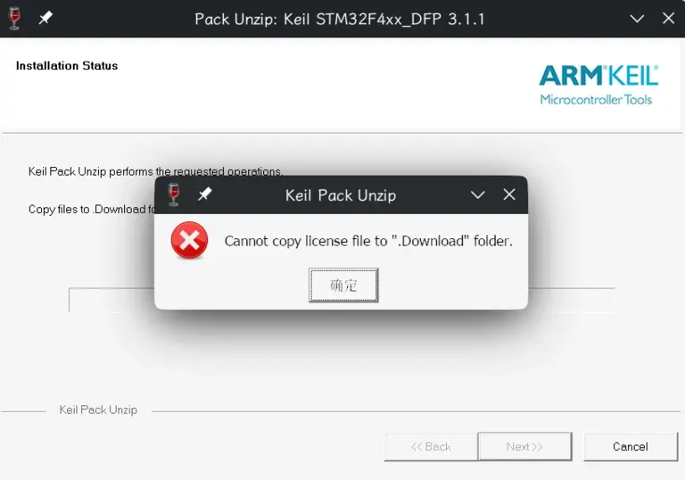
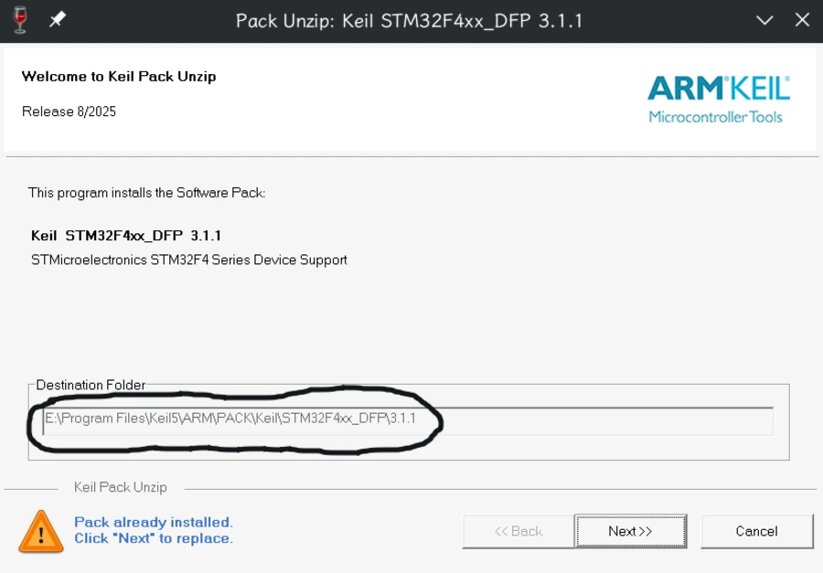
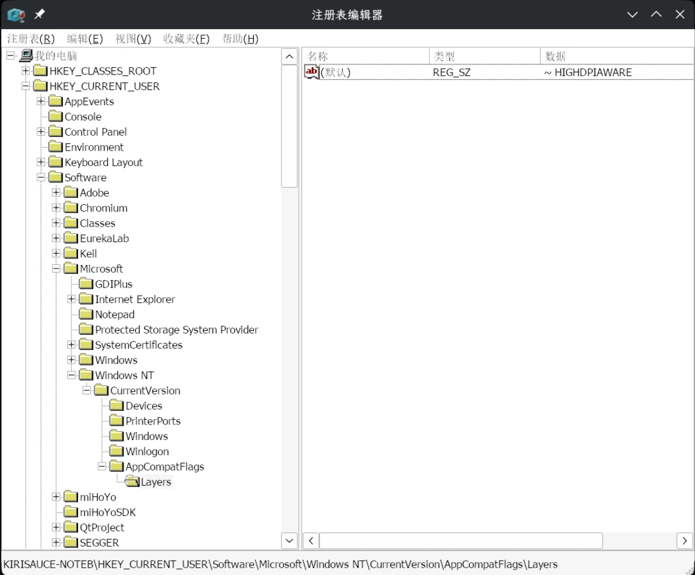
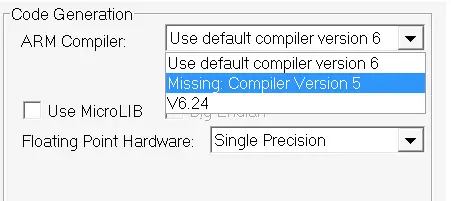
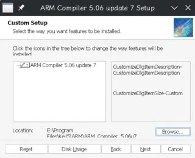
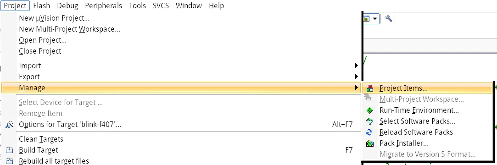
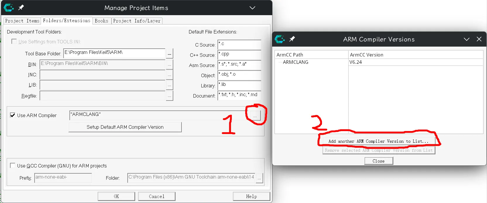
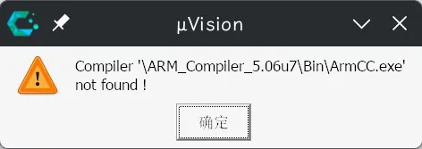

## Keil MDK的设备包无法安装

Keil的设备包是一个`*.pack`文件，当你试图在Wine下双击安装时，它会启动Keil附带的pack安装程序。

单击`Next`：::heimu[然后就爆了]



可能wine实现的问题。这个咱们暂时没法解决。那我们怎么安装pack呢？

```sh
❯ file Keil.STM32F4xx_DFP.3.1.1.pack  
Keil.STM32F4xx_DFP.3.1.1.pack: Zip archive data, made by v6.3 UNIX, extract using at least v2.0, last modified, last modified Sun, Aug 18 2025 08:09:04, uncompressed size 0, method=store
```

可以看到`.pack`文件是一个zip压缩包。所以我们可以手动把它解压到指定文件夹。
双击pack文件，安装界面上就有文件夹的路径：



新建这个文件夹，然后把pack文件里的东西全解压到这个文件夹下，然后重新打开Keil，就可以使用对应的设备了。

--------------------------------------

## Keil界面缩放模糊

HiDPI下的缩放也是牢大难问题了。参考[这篇文章](https://blog.csdn.net/AA1234567890_/article/details/148597805)的解决方案：

**以下内容依照`CC-BY-SA 4.0`取得授权。原作者：[`Ankah`](https://blog.csdn.net/AA1234567890_/)**

Wine新版本会自动对未适配高DPI的软件进行缩放，导致界面模糊。[issue](https://bugs.winehq.org/show_bug.cgi?id=57175)

打开wine的注册表编辑器：

```sh
wine regedit
```

编辑注册表键`HKEY_CURRENT_USER\Software\Microsoft\Windows NT\CurrentVersion\AppCompatFlags\Layers`的默认值为`~ HIGHDPIAWARE`。然后重启软件就可以了。



## 新版Keil没有ARM Compiler 5



你有一些历史遗留问题需要解决，但是你的`Keil 礦ision`又没有ARMCC5。
::heimu[先说结论，]从`Keil 礦ision 5.37`版本开始，它的安装包就不自带ARMCC5了，这时候就需要我们手动下载并安装ARMCC5。

[戳我跳转ARM官方下载页面](https://developer.arm.com/documentation/ka005198/latest)

往下滑，找到`Arm Compiler 5.06 update 7 (build 960)`，点进去下载（需要登录ARM账号）。
下载完，解压出来，可以看到一个`setup.exe`，双击它启动安装程序。
先不要急着一直点继续，因为我们需要修改安装路径。
首先你需要找到你的Keil安装路径（比如我这里在`E:\Program Files\Keil5`），这个路径下有一个目录叫`ARM`。
然后，就把ARMCC5的安装路径改到`ARM`路径下的子文件夹即可，关于这个文件夹的命名，必须要和它的默认目录名称一样。
比如这个版本的ARMCC就是`ARM_Compiler_5.06u7`，就把三个部分拼起来即可。
比如我这里安装到`E:\Program Files\Keil5\ARM\ARM_Compiler_5.06u7`。（必须安装在ARM这个目录下）



等待安装完成。然后打开`Keil 礦ision`，你会发现还是缺Compiler5。这是因为Keil还需要配置一下才知道你安装的编译器在哪里。

依次点开工具栏菜单<code><u>P</u>roject</code> \> <code><u>M</u>anage</code> \> <code><u>P</u>roject Items</code>。打开一个弹窗，切换弹窗的Tab到`Folders/Extensions`。
如图：





然后选择你的ArmCC安装路径即可添加。

### Linux Wine用户日常申必小报错



需要手动编辑文件。打开keil安装目录下的`TOOLS.ini`，找到`[ARMADS]`表，在自带的`ARMCCPATH0`条目下面新增一行：

```ini
ARMCCPATH1="ARM_Compiler_5.06u7" ("V5.06 update 7")
```

然后重启Keil即可

## 还没有Keil?

官方下载链接：
 - [最新版（5.43a）](https://armkeil.blob.core.windows.net/eval/MDK543a.exe)
 - [稍旧一点的（5.40）](https://armkeil.blob.core.windows.net/eval/MDK540.exe)
 - [第一个支持Community Edition（无需破解）的版本（5.37）](https://armkeil.blob.core.windows.net/eval/MDK537.EXE)
 - [最后一个自带ARMCC5的版本（5.36）](https://armkeil.blob.core.windows.net/eval/MDK536.EXE)
 - [开始支持CMSIS DAP v2的（5.27）](https://armkeil.blob.core.windows.net/eval/MDK527.EXE)
 - [网上流传比较多的（5.23）](https://armkeil.blob.core.windows.net/eval/MDK523.EXE)