# 前言

今年电赛材料清单里出现了无线图传这东西，就想着先研究一下怎么搞。
::heimu[真相是研究了三天，最后题目出来发现用不着，实际飞舞]

# 方案选择

商用图传，比如大疆的，虽然效果好，但是人家不给你开放接口没法用捏。

ESP32-CAM好是好，就是没有硬件视频编码模块，编码起来有点吃力，而且感觉性能也跟不上了。

最后，我们选择了openipc的图传方案。在开源社区的贡献下，这个方案已经基本上可用了 ::heimu[其实是不用自己造那么多轮子了]
我们买到的是安佳威视的MC800S模块，大概长这样：

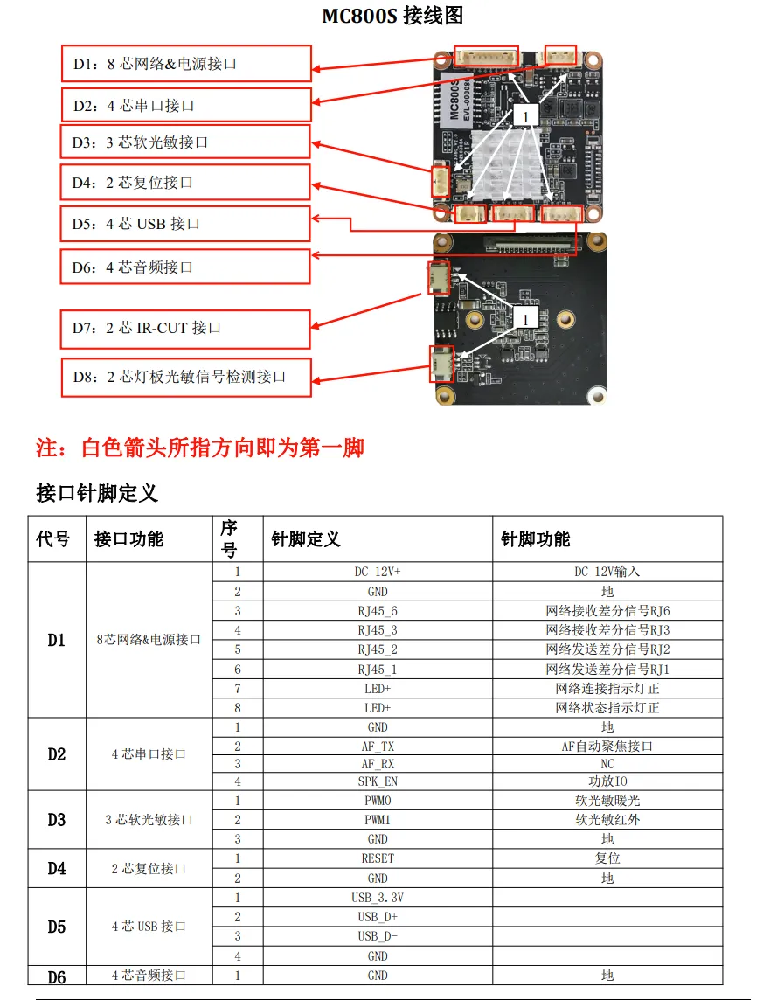

这个模块有个很神人的点，就是它的官方接线图上的USB D+和D-标反了！ ::heimu[不然就跟我一样浪费2小时才找到原因]
这是淘宝商家的肇事图片

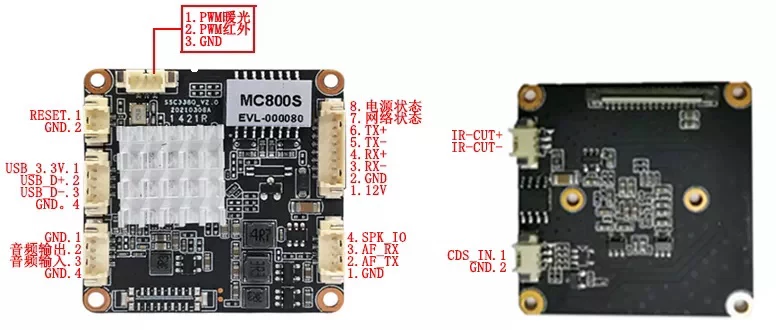

这么接才是对的！！！！！

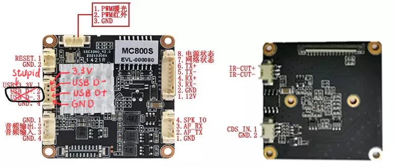

--------------------

无线通信方面使用的是`BL-M8812EU`，内部芯片为`RTL8812EU`。这个模块只支持5GHz频段的WiFi。
要把它连接到摄像头和地面站的话，需要自己焊接数据线和连接器上去。
数据手册放在最后了，图片太大了。

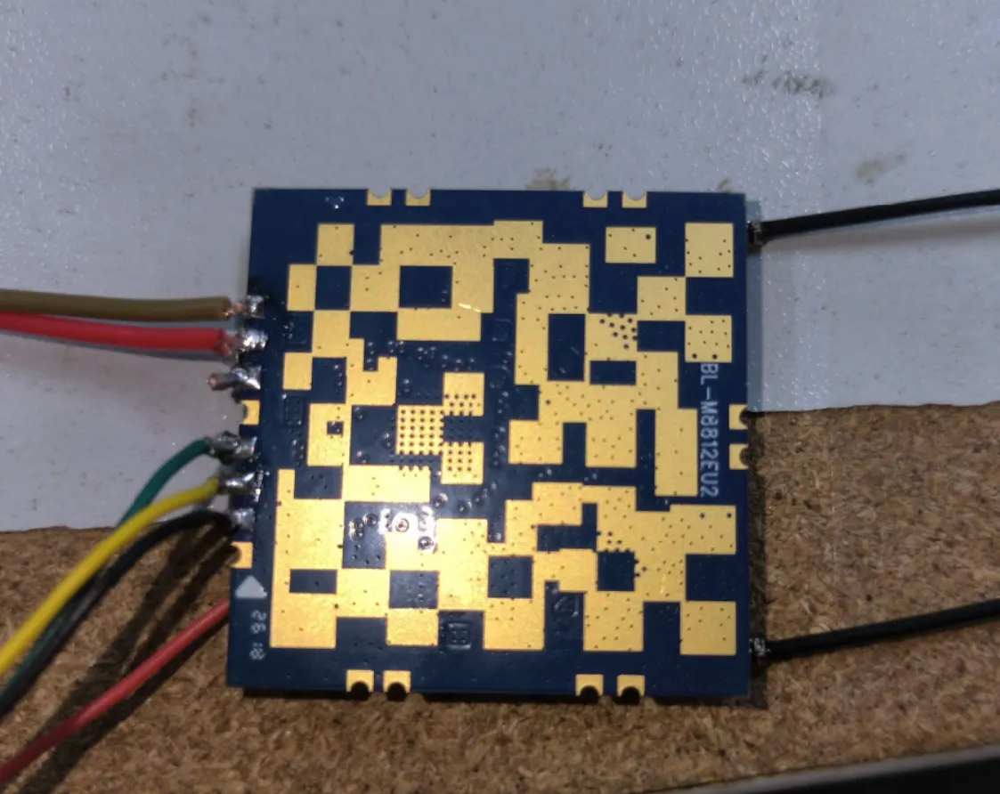

# 刷固件

## 刷前准备（硬件连接）

这块板子自带的固件是监控固件，没法满足我们的需求，并且tty没有账号密码也登录不进去，完全没法用。所以我们需要把它的固件刷成OpenIPC的固件。
SSC338Q是OpenIPC官方支持的SoC，所以它的固件还算是很好刷的。刷固件之前，我们需要连接到它的tty上，也就是它的串口终端（没错，这就是最原始的terminal）。
它的uart terminal引出到的是两个触点，所以你要么焊两根线上去要么拿个调试夹夹住 ::heimu[或者召唤另一双有形的大手按住] ::heimu[握握手]::heimu[,握握双手]。
然后你需要一个USB转UART的东西，然后RX对TX，TX对RX连接到这个设备上（别忘了GND，图中蓝色圈圈标出来的就是GND）。

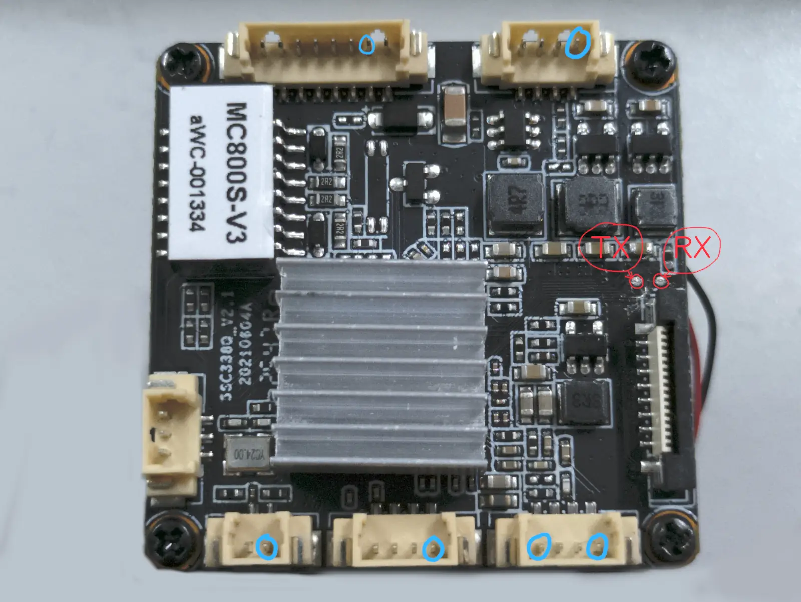

接线接好之后，用PuTTY或者minicom之类的软件打开串口，依旧115200bps 1stop no parity。
串口连接上之后掏出商家送的转换线，再拿一条RJ45网线，一端接转换线，一端插电脑，再插上12V电源，就可以把那个8P的连接器插入了。插入上电后会自动开机。

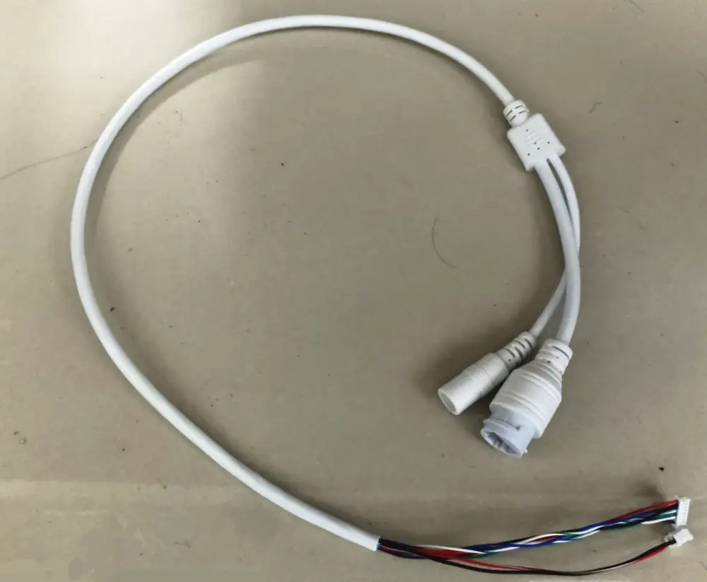

开机过程中你应该能在串口里看到类似这样的信息：

```log
IPL 85ea583
D-11
HW Reset
MCP1866_4X
miupll_400MHz
256MB

......

U-Boot 2015.01 (Aug 02 2022 - 15:48:47)

Version: I6E#g#######
I2C:   ready
DRAM:  
WARNING: Caches not enabled
MMC:   MStar SD/MMC: 0
nor_flash_mxp allocated success!!
Flash is detected (0x0B05, 0xC8, 0x40, 0x18)
SF: Detected nor0 with total size 16 MiB
MXP found at mxp_offset[2]=0x0000F000, size=0x1000
env_offset=0x3F000 env_size=0x1000
Flash is detected (0x0B05, 0xC8, 0x40, 0x18)
SF: Detected nor0 with total size 16 MiB
In:    serial
Out:   serial
Err:   serial
Net:   MAC Address 00:00:00:00:00:00
Auto-Negotiation...

......

##  Booting kernel from Legacy Image at 22000000 ...
   Image Name:   MVX4##I6E#g#######KL_LX409##[BR:
   Image Type:   ARM Linux Kernel Image (lzma compressed)
   Data Size:    2083496 Bytes = 2 MiB
   Load Address: 20008000
   Entry Point:  20008000
   Verifying Checksum ... OK
   Uncompressing Kernel Image ... 
[XZ] !!!reserved 0x21000000 length=0x 1000000 for xz!!
   XZ: uncompressed size=0x423000, ret=7
OK
atags:0x20000000

Starting kernel ...

Booting Linux on physical CPU 0x0
Linux version 4.9.84 (root@ubuntu) (gcc version 9.1.0 (GCC) ) #31 SMP PREEMPT Tue Sep 14 19:51:53 CST 2021
CPU: ARMv7 Processor [410fc075] revision 5 (ARMv7), cr=50c5387d
CPU: div instructions available: patching division code
CPU: PIPT / VIPT nonaliasing data cache, VIPT aliasing instruction cache

......

                      #             #    #                                                                              #  #      #         #                   
                       #            #    #                                                                              #   #      #  ########                  
                  ############      #    #        ####  ######    ####     #    ##   ## ####### ######     #            #          #  #     #                   
                  #          #     # #########     ##    ##  ##  ##  ##   ###   ### ###  ##  ##  ##  ##   ###     ############        #  #  #                   
                 #    #     #      #     #         ##    ##  ## ##    #  ## ##  #######  ##   #  ##  ##  ## ##    #     #       #######  #  #                   
 ######  ######       #           ##     #   #     ##    ##  ## ##      ##   ## #######  ## #    ##  ## ##   ##   #######           # #  #  #    ######  ###### 
                      #      #   # ############    ##    #####  ##      ##   ## ## # ##  ####    #####  ##   ##   #  #  #    #     #  #  #  #                   
                ############### #  #     #         ##    ##     ##      ####### ##   ##  ## #    ## ##  #######   #  #   #   #    ##  #  #  #                   
 ######  ######      #    #        #     #         ##    ##     ##      ##   ## ##   ##  ##      ##  ## ##   ##   ########  #    # ## #  #  #    ######  ###### 
                    #     #        #     #         ##    ##     ##    # ##   ## ##   ##  ##   #  ##  ## ##   ##   # #  # #  #   #  # ##  ## #                   
                   ##    #         # #########     ##    ##      ##  ## ##   ## ##   ##  ##  ##  ##  ## ##   ##   ##   #  ##       #  # # # #                   
                     ##  #         #     #        ####  ####      ####  ##   ## ##   ## ####### ###  ## ##   ##   # # #   #        #    # #                     
                       ##          #     #                                                                        #  #   ##        #   #  #   #                 
                      #  #         #     #   #                                                                   #  # # #  #  #    #   #  #   #                 
                    ##    ##       ############                                                                 #  #   #    # #    #  #    ####                 
                  ##       #       #                                                                                  #      ##    # #                          
```

里面信息很多，建议存到一个文本文件里。这里我们需要的信息是Flash大小和设备的MAC地址：

```log
Flash is detected (0x0B05, 0xC8, 0x40, 0x18)
SF: Detected nor0 with total size 16 MiB
In:    serial
Out:   serial
Err:   serial
Net:   MAC Address 00:00:00:00:00:00
```

可以看到我们的SoC的Flash大小是16MB。::heimu[16MB就能塞下一个Linux Kernel + Rootfs，实际强大]

## 刷前准备（软件和文件）

有了必要信息之后先别急，传输固件文件不是通过串口，串口只是给它发送命令而已。真正下载固件是通过Ethernet进行的。
确认你的Ethernet网卡连接到设备之后，按照下图配置你的有线网卡的IPv4地址：

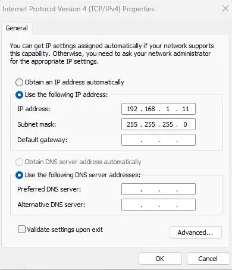

然后，我们还需要一个TFTP服务端软件。如果你用的是Arch系的Linux Distro可以直接

```sh
pacman -S tftp-hpa
sudo systemctl start tftpd.service
```

如果你是Windows用户，可以用`tftpd64`。

下一步，下载OpenIPC官方的配置工具`OpenIPC Companion`。
Linux用户想用Flatpak的话，可以到我的仓库里下载打包文件（链接在文末）。

::github[OpenIPC/companion]

之后，进入下一步————从openipc下载固件文件到本地

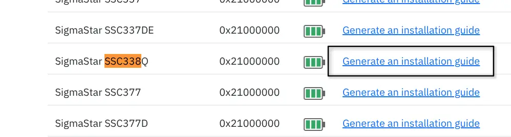

打开OpenIPC官网的[固件下载页面](https://openipc.org/supported-hardware/featured)，
找到我们需要的设备（SigmaStar SSC338Q），点击右侧的`Generate an installation guide`，进入如图所示的页面：

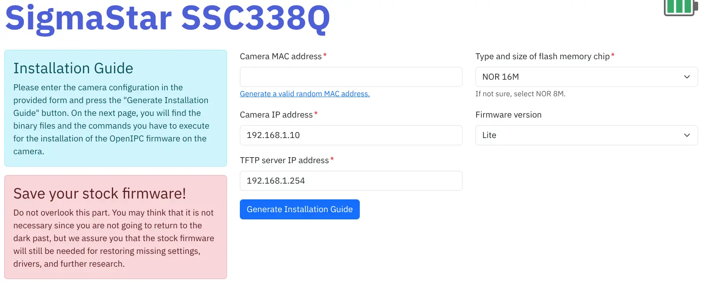

选好参数之后进入这个页面：

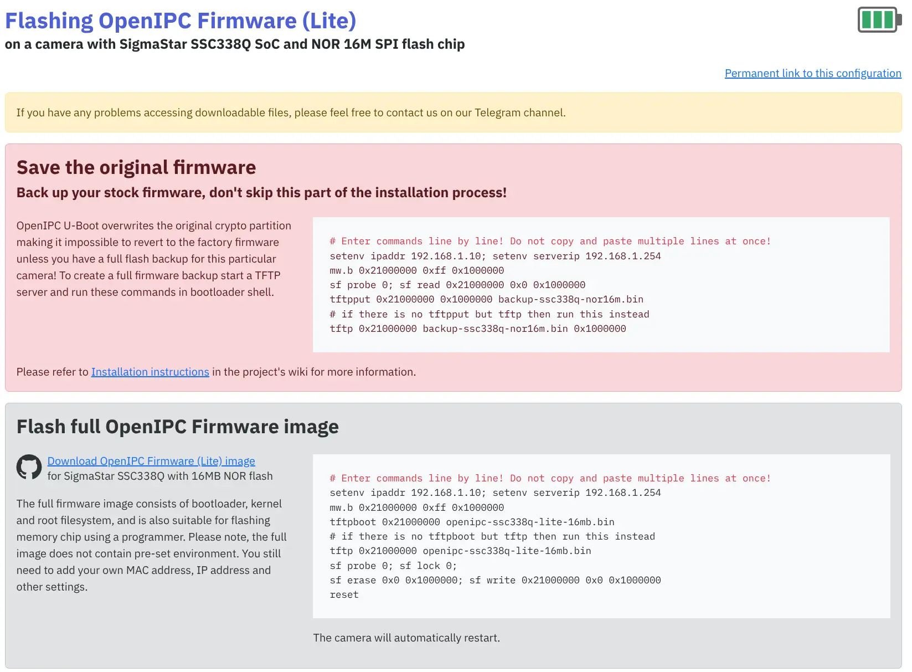

点击第二个卡片的下载链接，下载后得到一个大小有零有整的`.bin`文件。
然后把下载的固件复制到tftp的service文件夹。
（arch系的`tftp-hpa`服务目录在`/srv/tftp`。记得检查一下，不能带`eXecutable`权限位，否则读取的时候会显示`Permission denied`）

## 开始刷机

刷机通过U-Boot进行。首先打开你的串口软件，把设备的电源断掉。准备好之后接通电源，然后迅速按下`Enter`，然后接着`Ctrl+C`。
你的快捷键组合不一定跟我一样，如果失败了可以尝试按`Delete`、`F123456789101112`、`ESC`等键 ::heimu[或者把键盘都搓一遍]。
顺利的话，你会进入U-Boot的Shell（按键盘有回显了）

```sh
......

Auto-Negotiation...
Link Status Speed:100 Full-duplex:1
sstar_emac
Anjoy #
```

有了shell就可以按照下载页面的教程开始刷机了，手敲命令。这里放一下我的shell消息作为参考：

```sh
Anjoy # tftpboot 0x21000000 openipc-ssc338q-lite-16mb.bin
Using sstar_emac device
TFTP from server 10.42.0.1; our IP address is 10.42.0.2
Filename 'openipc-ssc338q-lite-16mb.bin'.
Load address: 0x21000000
Loading: #################################################################
	 #################################################################
	 #################################################################
	 #################################################################
	 #################################################################
	 #################################################################
	 #################################################################
	 #################################################################
	 #################################################################
	 #################################################################
	 #################################################################
	 #################################################################
	 #################################################################
	 #################################################################
	 #################################################################
	 #################################################################
	 #################################################################
	 ######################################
	 2.7 MiB/s
done
Bytes transferred = 16777216 (1000000 hex)
Anjoy # sf probe 0
Flash is detected (0x0B05, 0xC8, 0x40, 0x18)
SF: Detected nor0 with total size 16 MiB
Anjoy # sf lock 0
sf - SPI flash sub-system

Usage:
sf probe [[bus:]cs] [hz] [mode]	- init flash device on given SPI bus
				  and chip select
sf read addr offset len	- read `len' bytes starting at
				  `offset' to memory at `addr'
sf write addr offset len	- write `len' bytes from memory
				  at `addr' to flash at `offset'
sf erase offset [+]len		- erase `len' bytes from `offset'
				  `+len' round up `len' to block size
sf update addr offset len	- erase and write `len' bytes from memory
				  at `addr' to flash at `offset'
Anjoy # sf erase 0x0 0x1000000
_spi_flash_erase: addr 0x0, len 0x1000000
100%(cost 38279 ms)
SF: 16777216 bytes @ 0x0 Erased: OK
Anjoy # sf write 0x21000000 0x0 0x1000000
_spi_flash_write to 0x0, len 0x1000000 from 0x21000000
100%(cost 9177 ms)
SF: 16777216 bytes @ 0x0 Written: OK
Anjoy # reset
resetting ...
```

reset完之后就会启动OpenIPC的系统了，默认用户是root，密码12345即可登录进shell。

注意：
 - **每敲一条命令都要多核对两下有没有敲错!!!!!**
 - **不要复制粘贴命令，不要复制粘贴命令，不要复制粘贴命令（重要的事情说三遍）**

## 二次刷固件

为什么要二次刷固件呢？因为默认的固件并不包含FPV图传需要的软件和网卡驱动，所以我们刷完基础固件后要再更新为带FPV图传的固件版本。没刷FPV固件是没法保存WFB设置的。

刷完固件boot进系统后，就可以通过上面下载的配置工具`Companion`进行配置了。
只有两个页面？那应该是第一次打开Companion，先点击`Perferences`页面，关掉`Firmware focused mode`，然后重启软件即可。
打开Companion，右上角输入你的摄像头模块的IP和密码（ssh端口22一般不用改），切到`Firmware`页面，然后单击`Connect`按钮连接到摄像头。
成功连接之后，你就可以选择要更新的固件了。这里我们点击`Select by SoC`，选择`openipc.ssc338q-nor-fpg.tgz`**（注意如果你的设备是NAND Flash就选NAND版本）**。
单击`Update`按钮，Companion就会自动从GitHub下载固件并刷入了。

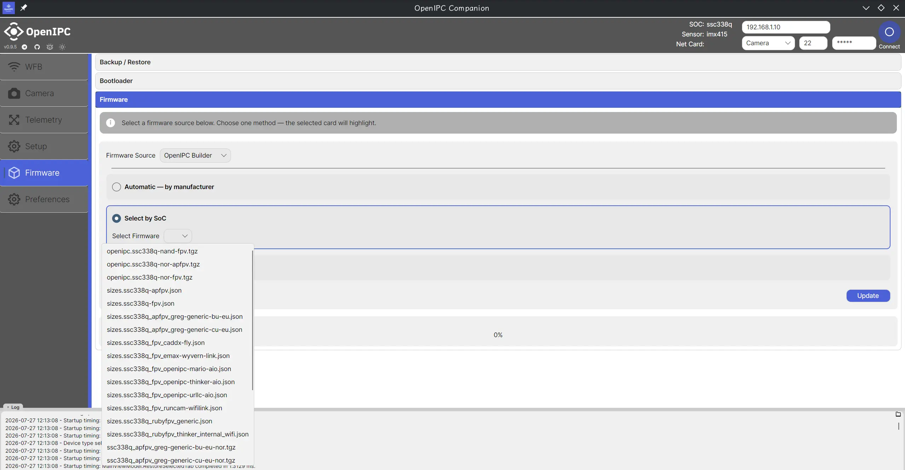

# 天空端设置

上一步刷完fpv固件之后，就可以正常调整WFB设置并保存了。记住你设置的`5.8GHz Frequency`的值，后面设置地面站的时候要用到。

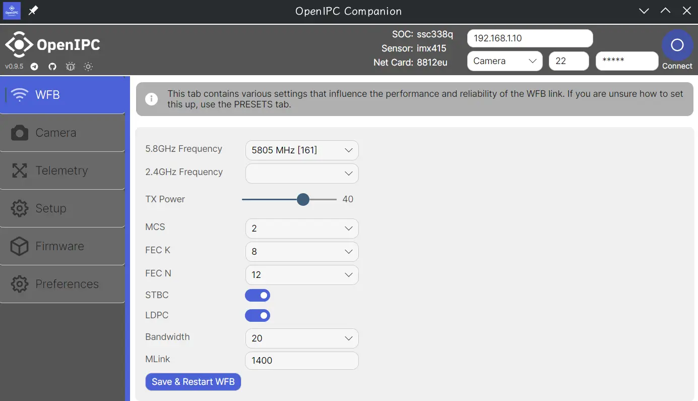

相机设置里可以调整输出分辨率，video stream编码，码率等，建议不要把画质调太高，增加传输负担的同时丢包率也会升高。

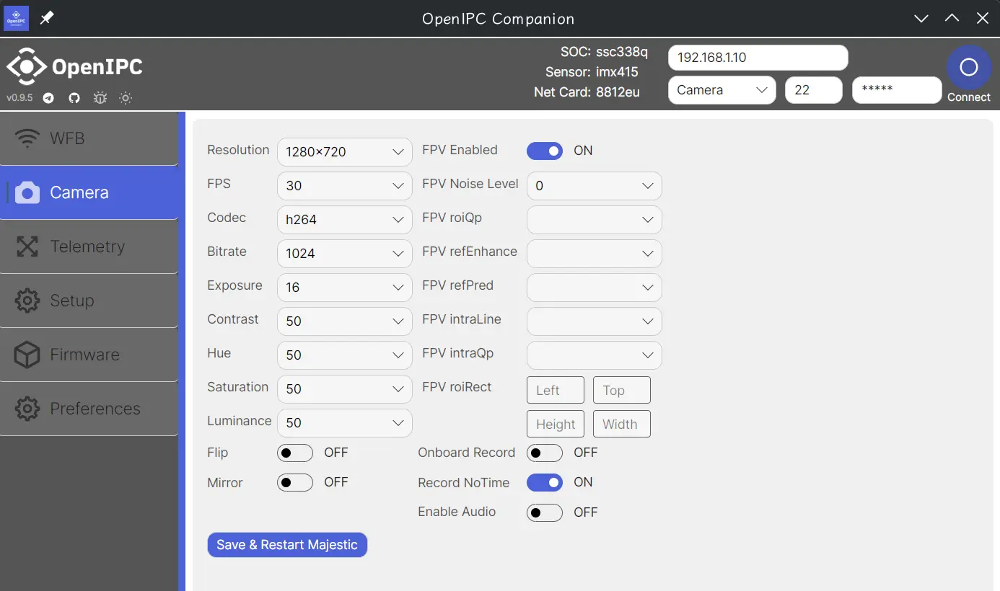

# 地面站

地面站用的是一块Raspberry Pi 4B。它通过USB连接到8812EU网卡，从而可以跟摄像头无线通信。首先就是这个网卡比较抽象，它没有标准的USB插座，所以我们需要自己焊一个usb插座上去：

（并没有图）

首先给树莓派装一下系统，这一步就不详细说了，装在SD卡里然后就能用了。

## 装网卡驱动

先装一下必要的软件包：

```sh
sudo apt install git build-essential wireless-tools dkms linux-headers
```

然后下载驱动源码

```sh
git clone https://github.com/svpcom/rtl8812eu.git
```

安装

```sh
cd rtl8812eu
sudo bash ./dkms-install.sh
```

重启之后，插上网卡，此时输入`sudo iw dev`应该能看到一个wireless设备（除了树莓派SoC自带的）。

## 安装FPV接收端

```sh
git clone https://github.com/svpcom/wfb-ng.git
cd wfb-ng
sudo bash scripts/install_gs.sh
```

## 视频播放器

以下两个方案二选一，也可以都安装，测试哪个能用就用哪个。

### QGroundControl

不推荐在树莓派上使用QGroundControl，有可能会出现兼容性问题，导致无法解码视频。如果有需要，可以通过flatpak安装

```sh
sudo apt install flatpak
sudo flatpak install org.mavlink.qgroundcontrol
```

### GStreamer直接解码

安装GStreamer

```sh
sudo apt install gstreamer1.0-tools

sudo apt install libgstreamer1.0-0 gir1.2-gst-plugins-base-1.0 gir1.2-gstreamer-1.0 \
	gstreamer1.0-plugins-bad gstreamer1.0-plugins-base gstreamer1.0-plugins-base-apps \
	gstreamer1.0-plugins-good gstreamer1.0
```

# 配置它们两个

两个设备还需要一点额外的配置才能开始正常工作。

## WiFi Channel

首先是配置WiFi信道，两端需要工作在同一个信道才能正常收发数据。
还记得前面设置的`5.8GHz Frequency`吗？现在就用到它了。
使用随便一个文本编辑器以Root身份打开`/etc/wifibroadcast.cfg`，修改`wifi_channel`字段为前面`5.8GHz Frequency`前面的数字（比如165）。
确保发送端的channel和接收端配置的channel一样，否则根本收不到数据的。

## 密钥

使用`install_gs.sh`安装的接收端会自动生成一对key，分别是`drone.key`和`gs.key`，分别对应发送端（天空端）和接收端（地面站）
 - `drone.key` - 包含发送端的私钥 + 接收端的公钥
 - `gs.key` - 包含接收端的私钥 + 发送端的公钥

把树莓派上的`drone.key`复制到你的主机里（连接OpenIPC设备的机器），然后使用`Companion`连接到设备，点进`Setup`标签页。这里有一个选项可以导入`drone.key`。
因为图传协议是加密的，所以需要两端的密钥配对才能成功解密。否则你在地面端能看到接收数据包，但是无法解密出有效视频流。

# 启动！

做完以上这些，就可以试着启动测试了。

先启动接收服务

```sh
sudo systemctl start wifibroadcast@gs
```

然后可以打开一个dashboard来监测有没有数据包收到

```sh
wfb-cli gs
```

随后给发送端上电，如果一切正常的话，就可以在`wfb-cli gs`的看板里看到接收计数在涨了。此时可以启动GStreamer播放视频流：

```sh
gst-launch-1.0 udpsrc port=5600 caps='application/x-rtp, media=(string)video, clock-rate=(int)90000, encoding-name=(string)H264' \
               ! rtph264depay ! avdec_h264 ! clockoverlay valignment=bottom ! autovideosink fps-update-interval=1000 sync=false
```

完

附M8812EU数据手册图片

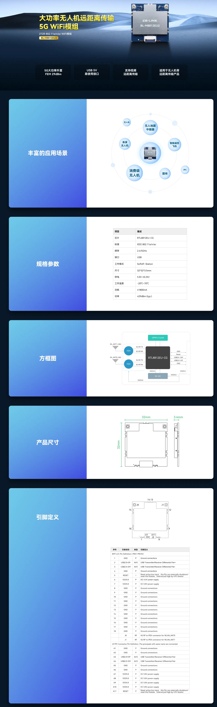