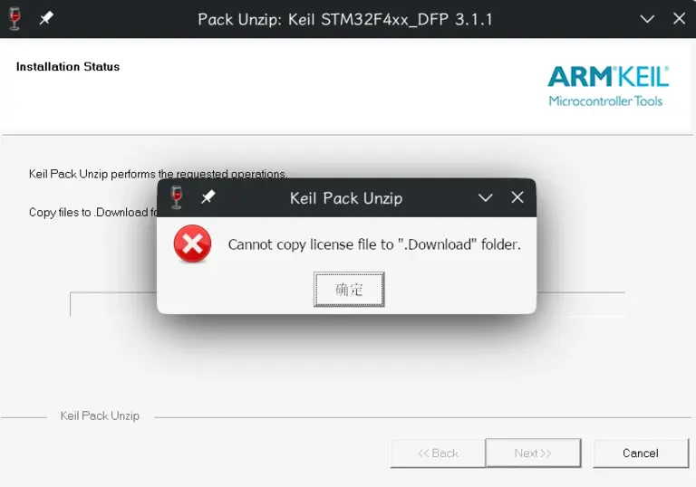
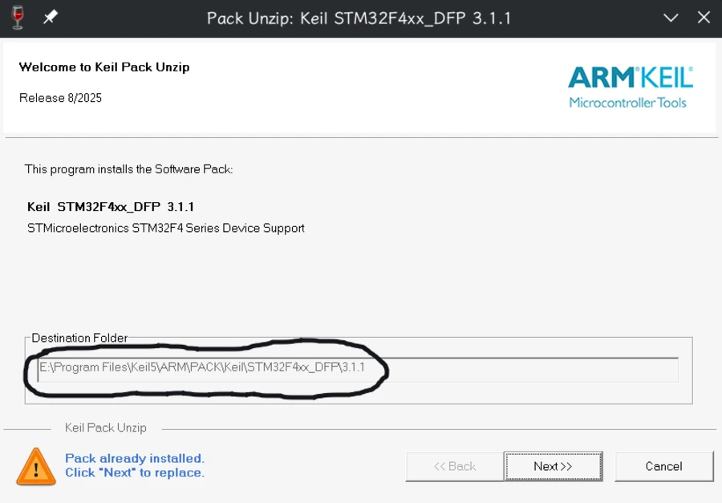
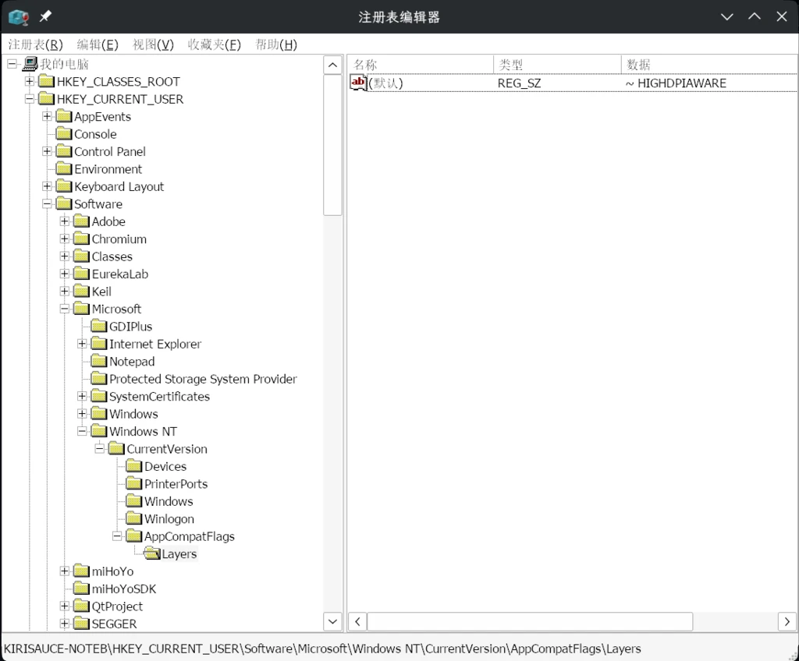

## Keil MDK的设备包无法安装

Keil的设备包是一个`*.pack`文件，当你试图在Wine下双击安装时，它会启动Keil附带的pack安装程序。

单击`Next`：<heimu>然后就爆了</heimu>



可能wine实现的问题。这个咱们暂时没法解决。那我们怎么安装pack呢？

```sh
❯ file Keil.STM32F4xx_DFP.3.1.1.pack  
Keil.STM32F4xx_DFP.3.1.1.pack: Zip archive data, made by v6.3 UNIX, extract using at least v2.0, last modified, last modified Sun, Aug 18 2025 08:09:04, uncompressed size 0, method=store
```

可以看到`.pack`文件是一个zip压缩包。所以我们可以手动把它解压到指定文件夹。
双击pack文件，安装界面上就有文件夹的路径：



新建这个文件夹，然后把pack文件里的东西全解压到这个文件夹下，然后重新打开Keil，就可以使用对应的设备了。

--------------------------------------

## Keil界面缩放模糊

HiDPI下的缩放也是牢大难问题了。参考[这篇文章](https://blog.csdn.net/AA1234567890_/article/details/148597805)的解决方案：

**以下内容依照`CC-BY-SA 4.0`取得授权。原作者：[`Ankah`](https://blog.csdn.net/AA1234567890_/)**

Wine新版本会自动对未适配高DPI的软件进行缩放，导致界面模糊。[issue](https://bugs.winehq.org/show_bug.cgi?id=57175)

打开wine的注册表编辑器：

```sh
wine regedit
```

编辑注册表键`HKEY_CURRENT_USER\Software\Microsoft\Windows NT\CurrentVersion\AppCompatFlags\Layers`的默认值为`~ HIGHDPIAWARE`。然后重启软件就可以了。

