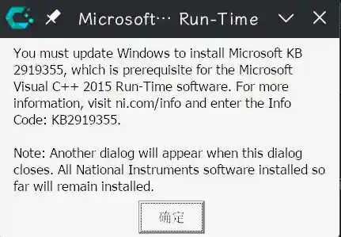

## 安装报错没有KB2919355
如果你尝试在Wine下安装Multisim 14.3，那你大概率会看到下面这个错误：



上面说我们没有安装KB2919355补丁，因此无法安装`VC2015 Runtime`。但是事实上我们不需要KB2919355也能装msvcrt2015，那为什么会报错呢？
事实上，multisim的安装程序里自带了一个msvcrt2015的安装包，它在安装的时候会自动运行。但是问题出在：它自带的bundle有个检查程序\(`SystemRequirementsError.exe`\)，会先检查是否有KB2919355。
虽然事实上不需要，但是它检查失败，就会导致安装中止。因为Wine没法正常安装这个补丁，所以我们选择hack一点的方法：跳过安装它自带的vc2015，咱手动安装。

### 修改安装list文件

新版本Multisim（14.3）的安装程序是模块化的，而且模块描述文件是明文的，极大方便了我们修改。

```sh
$ ls -T -I 'bin|pool'
 .
├──  autorun.exe
├──  autorun.inf
├──  feeds
│   └──  ni-cds-professional
│       ├── 󰡯 Packages
│       ├──  Packages.gz
│       └──  Packages.stamps
├──  Install.exe
├──  InstallCHS.dll
├──  InstallDEU.dll
├──  InstallFRA.dll
├──  InstallJPN.dll
├──  InstallKOR.dll
├──  patents.txt
├──  Readme_deu.html
└──  Readme_eng.html
```

其中`feeds/ni-cds-professional/Packages`和`feeds/ni-cds-professional/Packages.gz`就是我们要找的List文件。
用文本编辑器打开，搜索`Package: ni-msvcrt-`，找到这么两段：

```yaml
Architecture: windows_all
CompatibilityVersion: 190006
Conflicts: efba6f9e-f934-4bd7-ac51-60cca480489c (<<10.0.900)
Depends: ni-mdfsupport (>=19.0.0), ni-metauninstaller (>=19.0.0)
Description: NI installer for Microsoft's Visual C++ 2010 Runtime support (SP1)
DisplayName: Microsoft Visual C++ 2010 Run-Time
DisplayVersion: 10.0.40219.1
Filename: ../../pool/ni-msvcrt-2010_10.1.1.49152-0+f0_windows_all.nipkg
Homepage: http://www.ni.com
MD5sum: 4b257cea2d9aeca0b727baae3d4d2ca4
Maintainer: National Instruments <support@ni.com>
OsSupport: WINDOWS_7_SP1_32BIT WINDOWS_7_SP1_64BIT WINDOWS_81_32BIT WINDOWS_81_64BIT WINDOWS_10_32BIT WINDOWS_10_64BIT WINDOWS_EMBEDDED_STANDARD_7_SP1 WINDOWS_SERVER_2008_R2_SP1_64BIT WINDOWS_SERVER_2012_R2_64BIT
Package: ni-msvcrt-2010
Plugin: wininst
Priority: standard
Provides: ce498322-c378-4658-ba31-2e893787de28 (=10.11.49152), efba6f9e-f934-4bd7-ac51-60cca480489c (=10.11.49152)
Replaces: efba6f9e-f934-4bd7-ac51-60cca480489c (<<10.0.900)
Section: Infrastructure
Size: 12437016
Version: 10.1.1.49152-0+f0

Architecture: windows_all
CompatibilityVersion: 190006
Conflicts: d42e7bae-6589-4570-b6a3-3e28889392e7 (<<14.0.40000)
Depends: ni-mdfsupport (>=19.0.0), ni-metauninstaller (>=19.0.0), ni-msiproperties (>=19.0.0)
Description: NI installer for Microsoft Visual C++ 2015 Run-Time Update 3 (includes KB3118401)
DisplayName: Microsoft Visual C++ 2015 Run-Time
DisplayVersion: 14.1.4
Filename: ../../pool/ni-msvcrt-2015_14.1.5.49152-0+f0_windows_all.nipkg
Homepage: http://www.ni.com
MD5sum: 8e4b745a05fb8915820ca2c63fca0030
Maintainer: National Instruments <support@ni.com>
OsSupport: WINDOWS_7_SP1_32BIT WINDOWS_7_SP1_64BIT WINDOWS_81_32BIT WINDOWS_81_64BIT WINDOWS_10_32BIT WINDOWS_10_64BIT WINDOWS_EMBEDDED_STANDARD_7_SP1 WINDOWS_SERVER_2008_R2_SP1_64BIT WINDOWS_SERVER_2012_R2_64BIT
Package: ni-msvcrt-2015
Plugin: wininst
Priority: standard
Provides: ca17c748-8b26-41c5-8e58-bcab06909bfc (=14.15.49152), d42e7bae-6589-4570-b6a3-3e28889392e7 (=14.15.49152), ed7e4769-125a-49ec-8865-16560163b673 (=14.15.49152)
Replaces: d42e7bae-6589-4570-b6a3-3e28889392e7 (<<14.0.40000)
Section: Infrastructure
Size: 32770284
Version: 14.1.5.49152-0+f0
```

别的不用看，我们只要看下面这几个字段就够了。

```yaml
Filename: ../../pool/ni-msvcrt-2010_10.1.1.49152-0+f0_windows_all.nipkg
MD5sum: 4b257cea2d9aeca0b727baae3d4d2ca4
Package: ni-msvcrt-2010
Size: 12437016

Filename: ../../pool/ni-msvcrt-2015_14.1.5.49152-0+f0_windows_all.nipkg
MD5sum: 8e4b745a05fb8915820ca2c63fca0030
Package: ni-msvcrt-2015
Size: 32770284
```

我们要做的是把`ni-msvcrt-2015`的`Filename`, `MD5sum`, `Size`字段用`ni-msvcrt-2010`的相应字段替换掉，因为msvcrt2010的bundle没有补丁检查。
替换完成后be like

```yaml
Filename: ../../pool/ni-msvcrt-2010_10.1.1.49152-0+f0_windows_all.nipkg
MD5sum: 4b257cea2d9aeca0b727baae3d4d2ca4
Package: ni-msvcrt-2010
Size: 12437016

Filename: ../../pool/ni-msvcrt-2010_10.1.1.49152-0+f0_windows_all.nipkg
MD5sum: 4b257cea2d9aeca0b727baae3d4d2ca4
Package: ni-msvcrt-2015
Size: 12437016
```

别忘了还要把它用gzip压缩一下

```bash
gzip -k feeds/ni-cds-professional/Packages
```

还有手动安装msvcrt2015

```bash
winetricks vcrun2015
```

然后再启动安装程序就可以正常安装了~

## 启动报错无法加载数据库

Windows上也有这个报错，是因为它无法读写安装目录。但是Wine这里报错的原因不太一样，这里是因为Wine没有DAO模块和Jet数据库组件。
解决办法是从已有的Windows系统里复制`C:\Program Files (x86)\Common Files\Microsoft Shared\DAO`这个文件夹到Wine对应的文件夹里\(里面有个`dao360.dll`\)。
同时上网搜索`jet40sp8`安装程序来补上运行库即可。

## 蜂鸣器调参数不生效

可能是陈年老屎山发力了¿改完蜂鸣器参数之后，随便扯掉一根电线，然后按`Ctrl+Z`撤销，你修改的参数就会很神奇地生效了（

## 功率计/瓦特计没有读数

应该是汉化包导致的bug，你现在当务之急是先暂时删掉/禁用汉化包（你怎么安装的就怎么卸载，把`Chinese-simplified`文件夹挪走即可）。
然后打开英文版新建一个工程，重新摆好电路之后瓦特计就能用了，即使你重新装汉化包也没事。

# 参考

 - `Multisim under Linux` https://lina.moe/MultiSIM.md
 - `为什么我的瓦特计有时候有示数，有时候运行就没示数啊？搞得我好难受 - multisim吧 - 百度贴吧` https://tieba.baidu.com/p/6714510445
